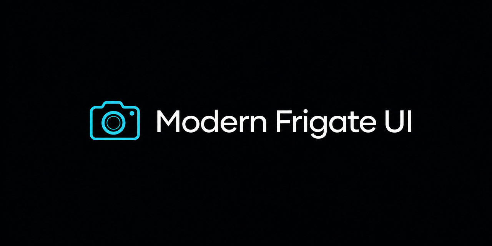

# Modern Frigate UI — Home Assistant Add-on Repository

A beautiful, mobile-first alternative frontend for [Frigate NVR](https://frigate.video),
packaged as a Home Assistant add-on and served entirely through Home Assistant Ingress.



## Install

1. In Home Assistant, go to **Settings → Add-ons → Add-on Store**.
2. Open the ⋮ menu → **Repositories**, and add:

   ```
   https://github.com/REPLACE_ME/modern-frigate-ui
   ```

3. Install **Modern Frigate UI**, start it, and open **Cameras** in the sidebar.

No Frigate credentials, API keys, long-lived tokens or cloud accounts are required.
Home Assistant is the only authentication boundary.

## Architecture

```
Phone / Browser
   │ HTTPS
   ▼
Home Assistant  ──  Ingress (authentication)
   │
   ▼
Modern Frigate UI add-on
   ├── React frontend (Vite, relative base — Ingress safe)
   ├── Fastify backend on :8099 (our own /api)
   ├── Frigate adapter  ─────────────►  Frigate :5000 (internal network only)
   └── Home Assistant adapter ───────►  http://supervisor/core/api
```

- Frigate's port 5000 is never exposed, never returned to the browser and never
  called from client JavaScript. All Frigate traffic is proxied by the backend.
- `SUPERVISOR_TOKEN` stays server-side.
- No host port is published by default — Ingress is the access mechanism.

## Highlights

- Home screen with lightweight, viewport-aware camera previews (no 8 parallel live streams).
- Immersive camera viewer that upgrades to WebRTC → MSE → HLS → preview frames.
- NVR-quality drag timeline with recording availability, detection markers, zoom
  levels (15m / 1h / 6h / 24h), live edge and jump-to-live.
- Activity feed with quick chips, bottom-sheet filters (camera, object, zone) and
  day grouping.
- Per-user preferences (favorites, order, density, clock, zoom) persisted in `/data`.
- Realtime detections streamed from the backend over SSE.

## Repository layout

```
repository.yaml            add-on repository descriptor
modern-frigate-ui/         the add-on
  config.yaml              add-on manifest (ingress, watchdog, options, schema)
  Dockerfile  run.sh       build + bashio startup
  DOCS.md  CHANGELOG.md    add-on documentation
  app/frontend             React + TypeScript + Vite + Tailwind UI
  app/backend              Fastify + TypeScript API and adapters
```

> The Lovable preview in this workspace renders the same frontend components with
> a demo dataset so the design can be reviewed without a Frigate instance.

## Development

```bash
cd modern-frigate-ui/app/backend  && npm install && npm run dev   # :8099
cd modern-frigate-ui/app/frontend && npm install && npm run dev
```

Set `FRIGATE_URL` to point the backend at a reachable Frigate instance, or leave
it empty to let discovery run.

## License

MIT — see [LICENSE](LICENSE).
